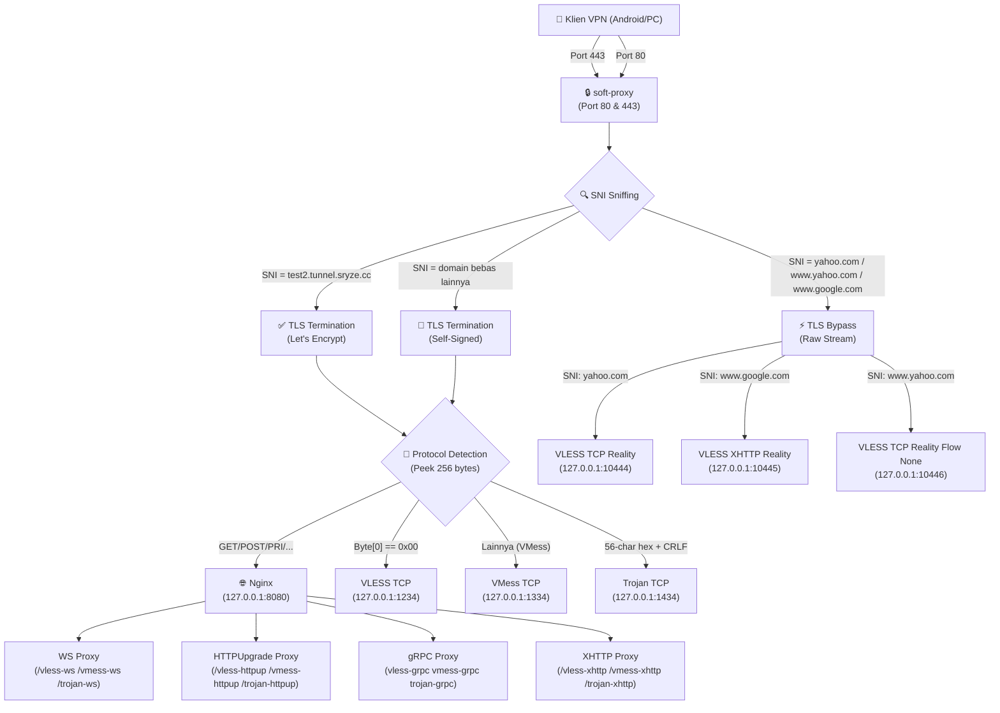

# Soft-Proxy: Multiplexer Server

Soft-Proxy adalah layanan **Multiplexer Server** (port-sharing) cerdas berbasis bahasa Go yang didesain untuk menyatukan berbagai protokol proxy (VLESS, VMess, Trojan, Reality) ke dalam port publik tunggal (Port 80 untuk HTTP, Port 443 untuk HTTPS/TLS).

Sistem ini didesain khusus untuk dijalankan di VPS linux dengan tingkat kehandalan tinggi, keamanan dari serangan Denial of Service (DoS) dan kebocoran memori, serta kompatibilitas penuh dengan bypass SSL/TLS SNI untuk protokol modern.

---

## 📂 Struktur Proyek (Project Structure)

Berikut adalah struktur folder dan berkas proyek Soft-Proxy beserta penjelasannya:

```text
soft/
├── cmd/
│   └── soft-proxy/            # Kode utama layanan server multiplexer
│       └── main.go
├── internal/                  # Package internal pendukung (Reusable modules)
│   ├── acme/                  # Integrasi tantangan ACME Let's Encrypt (HTTP & Cloudflare DNS)
│   │   └── acme.go
│   ├── autoblocker/           # Modul auto-blocker untuk mengamankan port dari scanner/probing
│   │   └── autoblocker.go
│   ├── config/                # Modul pemuatan & hot-reload otomatis berkas config.yaml
│   │   └── config.go
│   ├── core/                  # Engine utama multiplexing TLS, HTTP, WebSocket & sniffing SNI
│   │   ├── conn.go
│   │   ├── proxy.go
│   │   └── server.go
│   └── logger/                # Logging JSON & rotasi otomatis ukuran berkas log
│       └── logger.go
├── config.yaml                # Berkas konfigurasi utama untuk backends & domain
├── go.mod                     # Go Modules file dependensi
├── go.sum                     # Checksum dependensi Go
└── .gitignore                 # Daftar berkas yang diabaikan oleh Git (certs, log)
```

---

## 🏗️ 1. Diagram Arsitektur Multiplexing

Aliran penanganan koneksi masuk oleh `soft-proxy` divisualisasikan melalui diagram berikut:



---

## 🚦 2. Alur Keputusan Port & SNI

### Penanganan Port 443 (HTTPS/TLS)
1.  **TLS Bypass (Reality):** SNI dicocokkan dengan domain Reality (seperti `yahoo.com`, `www.google.com`, `www.yahoo.com`). Sambungan byte mentah langsung dialihkan (*piping*) ke port Xray Reality tujuan tanpa membongkar TLS handshake di tingkat multiplexer.
2.  **TLS Termination (Standar):** Jika SNI adalah domain resmi (`test2.tunnel.sryze.cc`) atau domain bebas lainnya, jabat tangan TLS diselesaikan di multiplexer menggunakan sertifikat resmi (ACME Let's Encrypt) atau fallback self-signed.
3.  **Protocol Sniffing:** Setelah TLS didekripsi, sistem membaca 256 byte data awal (*peek decrypted stream*) untuk mengenali protokol internal:
    *   `Byte[0] == 0x00` ➡️ VLESS TCP (`127.0.0.1:1234`)
    *   `56-character Hexadecimal + CRLF` ➡️ Trojan TCP (`127.0.0.1:1434`)
    *   `GET/POST/HTTP/..."` ➡️ Nginx (`127.0.0.1:8080`) untuk melayani WebSocket/gRPC/HTTPUpgrade path.
    *   Lainnya ➡️ VMess TCP (`127.0.0.1:1334`)

### Penanganan Port 80 (HTTP)
*   Jika berisi HTTP/2 Preface (`PRI `) atau path proxy khusus (`/vless-`, `/vmess-`, `/trojan-`), koneksi langsung dialihkan ke Nginx (`127.0.0.1:8080`).
*   Jika bukan permintaan proxy (misal `.well-known/acme-challenge/`), diproses oleh HTTP server bawaan Go untuk tantangan sertifikat Let's Encrypt atau langsung dialihkan (301 redirect) ke port HTTPS (443).

---

## 🗺️ 3. Pemetaan Port Lengkap

### Port Publik (Eksternal)

| Port | Protokol | Fungsi |
|------|----------|--------|
| **80** | HTTP | Tantangan Let's Encrypt (ACME), HTTP Redirection ke 443, dan Plain WebSocket/gRPC bypass |
| **443** | HTTPS/TLS | TLS Bypass (Reality) & TLS Termination (ACME / Self-Signed) |

### Port Lokal Xray & Nginx (127.0.0.1)

| Port | Protokol | Transport | Keterangan |
|------|----------|-----------|------------|
| **1234** | VLESS | TCP | Untuk koneksi TCP+TLS (setelah didekripsi soft-proxy) |
| **1235** | VLESS | WebSocket | Jalur path: `/vless-ws` |
| **1236** | VLESS | HTTPUpgrade | Jalur path: `/vless-httpupgrade` |
| **1237** | VLESS | gRPC | Nama Service: `vless-grpc` |
| **1238** | VLESS | XHTTP | Jalur path: `/vless-xhttp` |
| **1334** | VMess | TCP | Untuk koneksi TCP+TLS (setelah didekripsi soft-proxy) |
| **1335** | VMess | WebSocket | Jalur path: `/vmess-ws` |
| **1336** | VMess | HTTPUpgrade | Jalur path: `/vmess-httpupgrade` |
| **1337** | VMess | gRPC | Nama Service: `vmess-grpc` |
| **1338** | VMess | XHTTP | Jalur path: `/vmess-xhttp` |
| **1434** | Trojan | TCP | Untuk koneksi TCP+TLS (setelah didekripsi soft-proxy) |
| **1435** | Trojan | WebSocket | Jalur path: `/trojan-ws` |
| **1436** | Trojan | HTTPUpgrade | Jalur path: `/trojan-httpupgrade` |
| **1437** | Trojan | gRPC | Nama Service: `trojan-grpc` |
| **1438** | Trojan | XHTTP | Jalur path: `/trojan-xhttp` |
| **10444** | VLESS | TCP+Reality | XTLS-Reality (SNI: yahoo.com, Flow: xtls-rprx-vision) |
| **10445** | VLESS | XHTTP+Reality | XTLS-Reality (SNI: www.google.com, Flow: none) |
| **10446** | VLESS | TCP+Reality | XTLS-Reality (SNI: www.yahoo.com, Flow: none) |
| **8080** | Nginx | HTTP | Camouflage Web + Proxying HTTP/1.1 & HTTP/2 (WS, gRPC, XHTTP) |

---

## ⚙️ 4. Format Konfigurasi (`config.yaml`)

Berikut adalah berkas konfigurasi `config.yaml` yang digunakan oleh `soft-proxy` untuk memetakan port tujuan secara terpusat berdasarkan SNI:

```yaml
bind_addr: "0.0.0.0"
http_port: 80
https_port: 443

acme:
  enabled: true
  domains:
    - "test2.tunnel.sryze.cc"
  cache_dir: "./certs"
  dns_provider: "cloudflare"
  email: "admin@sryze.cc"
  cloudflare_token: "YOUR_CLOUDFLARE_API_TOKEN"

backends:
  vmess: "127.0.0.1:1334"
  vless: "127.0.0.1:1234"
  trojan: "127.0.0.1:1434"
  http: "127.0.0.1:8080"

reality_backends:
  # 1. Reality TCP Vision (Port 10444)
  "127.0.0.1:10444":
    - "yahoo.com"
    - "news.yahoo.com"

  # 2. Reality XHTTP (Port 10445)
  "127.0.0.1:10445":
    - "www.google.com"

  # 3. Reality TCP Flow None (Port 10446)
  "127.0.0.1:10446":
    - "www.yahoo.com"
```

---

## 🚀 5. Kompilasi & Menjalankan Aplikasi

Kompilasi kode menggunakan Go compiler:
```bash
go build -o bin/soft-proxy cmd/soft-proxy/main.go
```

Deploy sebagai systemd service `/etc/systemd/system/soft-proxy.service` agar selalu menyala di latar belakang:
```ini
[Unit]
Description=Soft Proxy Multiplexer
After=network.target

[Service]
Type=simple
User=root
WorkingDirectory=/root/proyek/soft
ExecStart=/root/proyek/soft/bin/soft-proxy
Restart=always
RestartSec=3

[Install]
WantedBy=multi-user.target
```

Nyalakan layanannya:
```bash
systemctl daemon-reload
systemctl enable soft-proxy
systemctl start soft-proxy
```
Dapatkan log aktivitas koneksi secara live melalui:
```bash
tail -f /var/log/soft-proxy/soft-proxy.log
```
