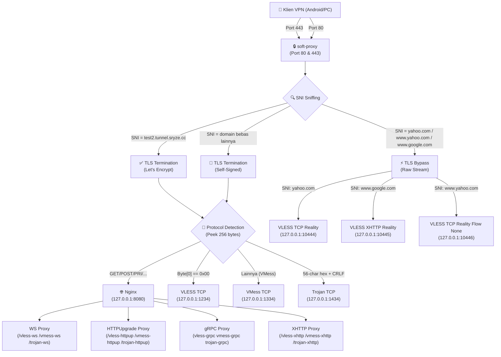

# Soft-Proxy: Multiplexer Server

Soft-Proxy adalah layanan **Multiplexer Server** (port-sharing) cerdas berbasis bahasa Go yang didesain untuk menyatukan berbagai protokol proxy (VLESS, VMess, Trojan, Reality) ke dalam port publik tunggal (Port 80 untuk HTTP, Port 443 untuk HTTPS/TLS).

Sistem ini didesain khusus untuk dijalankan di VPS linux dengan tingkat kehandalan tinggi, keamanan dari serangan Denial of Service (DoS) dan kebocoran memori, serta kompatibilitas penuh dengan bypass SSL/TLS SNI untuk protokol modern.

---

## 📂 Struktur Proyek (Project Structure)

Berikut adalah struktur folder dan berkas proyek Soft-Proxy beserta penjelasannya:

```text
soft/
├── cmd/
│   └── soft-proxy/            # Kode utama layanan server multiplexer
│       └── main.go
├── internal/                  # Package internal pendukung (Reusable modules)
│   ├── acme/                  # Integrasi tantangan ACME Let's Encrypt (HTTP & Cloudflare DNS)
│   │   └── acme.go
│   ├── autoblocker/           # Modul auto-blocker untuk mengamankan port dari scanner/probing
│   │   └── autoblocker.go
│   ├── config/                # Modul pemuatan & hot-reload otomatis berkas config.yaml
│   │   └── config.go
│   ├── core/                  # Engine utama multiplexing TLS, HTTP, WebSocket & sniffing SNI
│   │   ├── conn.go
│   │   ├── proxy.go
│   │   └── server.go
│   └── logger/                # Logging JSON & rotasi otomatis ukuran berkas log
│       └── logger.go
├── config.yaml                # Berkas konfigurasi utama untuk backends & domain
├── go.mod                     # Go Modules file dependensi
├── go.sum                     # Checksum dependensi Go
└── .gitignore                 # Daftar berkas yang diabaikan oleh Git (certs, log)
```

---

## 🏗️ 1. Diagram Arsitektur Multiplexing

Aliran penanganan koneksi masuk oleh `soft-proxy` divisualisasikan melalui diagram berikut:



---

## 🚦 2. Alur Keputusan Port & SNI

### Penanganan Port 443 (HTTPS/TLS)
1.  **TLS Bypass (Reality):** SNI dicocokkan dengan domain Reality (seperti `yahoo.com`, `www.google.com`, `www.yahoo.com`). Sambungan byte mentah langsung dialihkan (*piping*) ke port Xray Reality tujuan tanpa membongkar TLS handshake di tingkat multiplexer.
2.  **TLS Termination (Standar):** Jika SNI adalah domain resmi (`test2.tunnel.sryze.cc`) atau domain bebas lainnya, jabat tangan TLS diselesaikan di multiplexer menggunakan sertifikat resmi (ACME Let's Encrypt) atau fallback self-signed.
3.  **Protocol Sniffing:** Setelah TLS didekripsi, sistem membaca 256 byte data awal (*peek decrypted stream*) untuk mengenali protokol internal:
    *   `Byte[0] == 0x00` ➡️ VLESS TCP (`127.0.0.1:1234`)
    *   `56-character Hexadecimal + CRLF` ➡️ Trojan TCP (`127.0.0.1:1434`)
    *   `GET/POST/HTTP/..."` ➡️ Nginx (`127.0.0.1:8080`) untuk melayani WebSocket/gRPC/HTTPUpgrade path.
    *   Lainnya ➡️ VMess TCP (`127.0.0.1:1334`)

### Penanganan Port 80 (HTTP)
*   Jika berisi HTTP/2 Preface (`PRI `) atau path proxy khusus (`/vless-`, `/vmess-`, `/trojan-`), koneksi langsung dialihkan ke Nginx (`127.0.0.1:8080`).
*   Jika bukan permintaan proxy (misal `.well-known/acme-challenge/`), diproses oleh HTTP server bawaan Go untuk tantangan sertifikat Let's Encrypt atau langsung dialihkan (301 redirect) ke port HTTPS (443).

---

## ✨ Fitur Utama (Core Features)

Layanan `soft-proxy` dilengkapi dengan fitur-fitur canggih untuk menjamin performa, keamanan, dan fungsionalitas tingkat tinggi:

1. **Multiplexing Berbasis Protokol & SNI (SNI & Protocol-Based Multiplexing)**
   * Mencegat lalu lintas data pada Port 80 & 443, menyaring domain SNI lewat [server.go](file:///root/proyek/soft/internal/core/server.go).
   * Melakukan dekripsi TLS standar dan *peeking stream* (256 byte pertama via [conn.go](file:///root/proyek/soft/internal/core/conn.go)) untuk membedakan secara instan protokol VLESS, Trojan, VMess, atau HTTP (Nginx).

2. **TLS Bypass Mentah (Zero-Decryption TLS Bypass / Reality Support)**
   * Mendukung pengalihan lalu lintas Xray Reality secara langsung (*raw TCP stream piping* via [proxy.go](file:///root/proyek/soft/internal/core/proxy.go)) ke backend port Reality tanpa mendekripsi TLS, menghemat penggunaan CPU dan mempertahankan efektivitas obfuscation XTLS-Reality.

3. **Perlindungan Terhadap Pemindaian Port (Auto-Blocker / Active Probing Protection)**
   * Memanfaatkan modul [autoblocker.go](file:///root/proyek/soft/internal/autoblocker/autoblocker.go) untuk mendeteksi scanner atau koneksi ilegal (seperti handshake TLS parsial/gagal).
   * Memblokir IP mencurigakan secara dinamis (*temporary blacklist*) dengan efisien menggunakan goroutine sweeper terpusat tanpa membebani memori server.

4. **Manajemen Sertifikat ACME Terintegrasi (Automatic ACME Let's Encrypt)**
   * Menggunakan pustaka ACME melalui [acme.go](file:///root/proyek/soft/internal/acme/acme.go) untuk menerbitkan dan memperbarui sertifikat Let's Encrypt secara otomatis (HTTP-01 challenge).
   * Otomatis membuat sertifikat lokal (*self-signed certificate fallback*) untuk domain tidak terdaftar agar TLS Handshake port 443 tetap stabil.

5. **Pemuatan Ulang Konfigurasi Tanpa Henti (Thread-Safe Hot-Reload)**
   * Memantau berkas [config.yaml](file:///root/proyek/soft/config.yaml) secara berkala via [config.go](file:///root/proyek/soft/internal/config/config.go). Perubahan backend atau domain Reality akan dimuat secara dinamis tanpa perlu mematikan atau menghentikan koneksi aktif di server multiplexer.

6. **Pencatatan Aktivitas Terstruktur & Rotasi Log (Structured JSON Logging)**
   * Menggunakan logger terpusat di [logger.go](file:///root/proyek/soft/internal/logger/logger.go) yang mencatat log dalam format JSON.
   * Mencegah kepenuhan penyimpanan disk melalui sistem *log rotation* otomatis berdasarkan ukuran berkas.

---

## 🗺️ 3. Pemetaan Port Lengkap

### Port Publik (Eksternal)

| Port | Protokol | Fungsi |
|------|----------|--------|
| **80** | HTTP | Tantangan Let's Encrypt (ACME), HTTP Redirection ke 443, dan Plain WebSocket/gRPC bypass |
| **443** | HTTPS/TLS | TLS Bypass (Reality) & TLS Termination (ACME / Self-Signed) |

### Port Lokal Xray & Nginx (127.0.0.1)

| Port | Protokol | Transport | Keterangan |
|------|----------|-----------|------------|
| **1234** | VLESS | TCP | Untuk koneksi TCP+TLS (setelah didekripsi soft-proxy) |
| **1235** | VLESS | WebSocket | Jalur path: `/vless-ws` |
| **1236** | VLESS | HTTPUpgrade | Jalur path: `/vless-httpupgrade` |
| **1237** | VLESS | gRPC | Nama Service: `vless-grpc` |
| **1238** | VLESS | XHTTP | Jalur path: `/vless-xhttp` |
| **1334** | VMess | TCP | Untuk koneksi TCP+TLS (setelah didekripsi soft-proxy) |
| **1335** | VMess | WebSocket | Jalur path: `/vmess-ws` |
| **1336** | VMess | HTTPUpgrade | Jalur path: `/vmess-httpupgrade` |
| **1337** | VMess | gRPC | Nama Service: `vmess-grpc` |
| **1338** | VMess | XHTTP | Jalur path: `/vmess-xhttp` |
| **1434** | Trojan | TCP | Untuk koneksi TCP+TLS (setelah didekripsi soft-proxy) |
| **1435** | Trojan | WebSocket | Jalur path: `/trojan-ws` |
| **1436** | Trojan | HTTPUpgrade | Jalur path: `/trojan-httpupgrade` |
| **1437** | Trojan | gRPC | Nama Service: `trojan-grpc` |
| **1438** | Trojan | XHTTP | Jalur path: `/trojan-xhttp` |
| **10443** | VLESS | TCP+TLS | Port Fallback TLS Standard (Dengan sertifikat self-signed) |
| **10444** | VLESS | TCP+Reality | XTLS-Reality (SNI: `yahoo.com`, Flow: `xtls-rprx-vision`) |
| **10445** | VLESS | XHTTP+Reality | XTLS-Reality (SNI: `www.google.com`, Flow: `none`, path: `/vless-xhttp-reality`) |
| **10446** | VLESS | TCP+Reality | XTLS-Reality (SNI: `www.yahoo.com`, Flow: `none`) |
| **10554** | VMess | TCP+Reality | VMess Reality (SNI: `www.cisco.com`, Flow: `none`) |
| **10555** | VMess | XHTTP+Reality | VMess Reality (SNI: `www.speedtest.net`, Flow: `none`, path: `/vmess-xhttp-reality`) |
| **10556** | VMess | TCP+Reality | VMess Reality (SNI: `www.bing.com`, Flow: `none`) |
| **10664** | Trojan | TCP+Reality | Trojan Reality (SNI: `apple.com`, Flow: `none`) |
| **10665** | Trojan | XHTTP+Reality | Trojan Reality (SNI: `www.icloud.com`, Flow: `none`, path: `/trojan-xhttp-reality`) |
| **8080** | Nginx | HTTP | Camouflage Web + Proxying HTTP/1.1 & HTTP/2 (WS, gRPC, XHTTP) |

---

## ⚙️ 4. Format Konfigurasi (`config.yaml`)

Berikut adalah berkas konfigurasi `config.yaml` yang digunakan oleh `soft-proxy` untuk memetakan port tujuan secara terpusat berdasarkan SNI:

```yaml
bind_addr: "0.0.0.0"
http_port: 80
https_port: 443

acme:
  enabled: true
  domains:
    - "test2.tunnel.sryze.cc"
  cache_dir: "./certs"

backends:
  vmess: "127.0.0.1:1334"
  vless: "127.0.0.1:1234"
  trojan: "127.0.0.1:1434"
  http: "127.0.0.1:8080"

reality_backends:
  # VLESS Reality
  "127.0.0.1:10444":
    - "yahoo.com"
  "127.0.0.1:10445":
    - "www.google.com"
  "127.0.0.1:10446":
    - "www.yahoo.com"

  # VMess Reality
  "127.0.0.1:10554":
    - "www.cisco.com"
  "127.0.0.1:10555":
    - "www.speedtest.net"
  "127.0.0.1:10556":
    - "www.bing.com"

  # Trojan Reality
  "127.0.0.1:10664":
    - "apple.com"
  "127.0.0.1:10665":
    - "www.icloud.com"
```

---

## 🚀 5. Kompilasi & Menjalankan Aplikasi

Kompilasi kode menggunakan Go compiler:
```bash
go build -o bin/soft-proxy cmd/soft-proxy/main.go
```

Deploy sebagai systemd service `/etc/systemd/system/soft-proxy.service` agar selalu menyala di latar belakang:
```ini
[Unit]
Description=Soft Proxy Multiplexer
After=network.target

[Service]
Type=simple
User=root
WorkingDirectory=/root/proyek/soft
ExecStart=/root/proyek/soft/bin/soft-proxy
Restart=always
RestartSec=3

[Install]
WantedBy=multi-user.target
```

Nyalakan layanannya:
```bash
systemctl daemon-reload
systemctl enable soft-proxy
systemctl start soft-proxy
```
Dapatkan log aktivitas koneksi secara live melalui:
```bash
tail -f /var/log/soft-proxy/soft-proxy.log
```

---

## 🔍 6. Contoh Tautan Impor Klien Xray (Client Import URL Examples)

Berikut adalah daftar lengkap **38 contoh tautan impor (*URL import links*)** untuk klien VPN (seperti v2rayNG, Nekobox, Shadowrocket, atau Xray CLI) agar terhubung ke server multiplexer `soft-proxy`:

### A. Tautan Klien Port 443 TLS (Sertifikat Let's Encrypt / ACME Valid)

| Skenario Protokol | Protokol | Keamanan | Transport | Tautan Impor Klien (Client Import URL) |
| :--- | :--- | :--- | :--- | :--- |
| **VLESS TCP + TLS** | VLESS | TLS | TCP | `vless://09abf07d-a8ea-4748-9f37-5b3dca0e0a94@test2.tunnel.sryze.cc:443?encryption=none&security=tls&sni=test2.tunnel.sryze.cc#VLESS-TCP-TLS` |
| **VLESS WebSocket + TLS** | VLESS | TLS | WS | `vless://09abf07d-a8ea-4748-9f37-5b3dca0e0a94@test2.tunnel.sryze.cc:443?encryption=none&security=tls&sni=test2.tunnel.sryze.cc&type=ws&path=%2Fvless-ws#VLESS-WS-TLS` |
| **VLESS HTTPUpgrade + TLS** | VLESS | TLS | HTTPUpgrade | `vless://09abf07d-a8ea-4748-9f37-5b3dca0e0a94@test2.tunnel.sryze.cc:443?encryption=none&security=tls&sni=test2.tunnel.sryze.cc&type=httpupgrade&path=%2Fvless-httpupgrade#VLESS-HTTPUpgrade-TLS` |
| **VLESS gRPC + TLS** | VLESS | TLS | gRPC | `vless://09abf07d-a8ea-4748-9f37-5b3dca0e0a94@test2.tunnel.sryze.cc:443?encryption=none&security=tls&sni=test2.tunnel.sryze.cc&type=grpc&serviceName=vless-grpc#VLESS-gRPC-TLS` |
| **VLESS XHTTP + TLS** | VLESS | TLS | XHTTP | `vless://09abf07d-a8ea-4748-9f37-5b3dca0e0a94@test2.tunnel.sryze.cc:443?encryption=none&security=tls&sni=test2.tunnel.sryze.cc&type=xhttp&path=%2Fvless-xhttp#VLESS-XHTTP-TLS` |
| **VMess TCP + TLS** | VMess | TLS | TCP | `vmess://eyJ2IjoiMiIsInBzIjoiVk1FU1MtVENQLVRMUyIsImFkZCI6InRlc3QyLnR1bm5lbC5zcnl6ZS5jYyIsInBvcnQiOiI0NDMiLCJpZCI6IjhlNDJiNDc4LTNhNGItNDhiMC1hZDJlLWE1ODYyNWFjZGE4ZSIsImFpZCI6IjAiLCJuZXQiOiJ0Y3AiLCJ0eXBlIjoibm9uZSIsInRscyI6InRscyIsInNuaSI6InRlc3QyLnR1bm5lbC5zcnl6ZS5jYyJ9` |
| **VMess WebSocket + TLS** | VMess | TLS | WS | `vmess://eyJ2IjoiMiIsInBzIjoiVk1FU1MtV1MtVExTIiwiYWRkIjoidGVzdDIudHVubmVsLnNyeXplLmNjIiwicG9ydCI6IjQ0MyIsImlkIjoiOGU0MmI0NzgtM2E0Yi00OGIwLWFkMmUtYTU4NjI1YWNkYThlIiwiYWlkIjoiMCIsIm5ldCI6IndzIiwidHlwZSI6Im5vbmUiLCJob3N0IjoidGVzdDIudHVubmVsLnNyeXplLmNjIiwicGF0aCI6Ii92bWVzcy13cyIsInRscyI6InRscyIsInNuaSI6InRlc3QyLnR1bm5lbC5zcnl6ZS5jYyJ9` |
| **VMess HTTPUpgrade + TLS** | VMess | TLS | HTTPUpgrade | `vmess://eyJ2IjoiMiIsInBzIjoiVk1FU1MtSFRUUFVwLVRMUyIsImFkZCI6InRlc3QyLnR1bm5lbC5zcnl6ZS5jYyIsInBvcnQiOiI0NDMiLCJpZCI6IjhlNDJiNDc4LTNhNGItNDhiMC1hZDJlLWE1ODYyNWFjZGE4ZSIsImFpZCI6IjAiLCJuZXQiOiJodHRwdXBncmFkZSIsInR5cGUiOiJub25lIiwiaG9zdCI6InRlc3QyLnR1bm5lbC5zcnl6ZS5jYyIsInBhdGgiOiIvdm1lc3MtaHR0cHVwZ3JhZGUiLCJ0bHMiOiJ0bHMiLCJzbmkiOiJ0ZXN0Mi50dW5uZWwuc3J5emUuY2MifQ==` |
| **VMess gRPC + TLS** | VMess | TLS | gRPC | `vmess://eyJ2IjoiMiIsInBzIjoiVk1FU1MtZ1JQQy1UTFMiLCJhZGQiOiJ0ZXN0Mi50dW5uZWwuc3J5emUuY2MiLCJwb3J0IjoiNDQzIiwiaWQiOiI4ZTQyYjQ3OC0zYTRiLTQ4YjAtYWQyZS1hNTg2MjVhY2RhOGUiLCJhaWQiOiIwIiwibmV0IjoiZ3JwYyIsInR5cGUiOiJub25lIiwicGF0aCI6InZtZXNzLWdycGMiLCJ0bHMiOiJ0bHMiLCJzbmkiOiJ0ZXN0Mi50dW5uZWwuc3J5emUuY2MifQ==` |
| **VMess XHTTP + TLS** | VMess | TLS | XHTTP | `vmess://eyJ2IjoiMiIsInBzIjoiVk1FU1MtWUhUVFAtVExTIiwiYWRkIjoidGVzdDIudHVubmVsLnNyeXplLmNjIiwicG9ydCI6IjQ0MyIsImlkIjoiOGU0MmI0NzgtM2E0Yi00OGIwLWFkMmUtYTU4NjI1YWNkYThlIiwiYWlkIjoiMCIsIm5ldCI6InhodHRwIiwidHlwZSI6Im5vbmUiLCJob3N0IjoidGVzdDIudHVubmVsLnNyeXplLmNjIiwicGF0aCI6Ii92bWVzcy14aHR0cCIsInRscyI6InRscyIsInNuaSI6InRlc3QyLnR1bm5lbC5zcnl6ZS5jYyJ9` |
| **Trojan TCP + TLS** | Trojan | TLS | TCP | `trojan://140141d26c7dfa2171cf1cc460190ba2@test2.tunnel.sryze.cc:443?security=tls&type=tcp&sni=test2.tunnel.sryze.cc#Trojan-TCP-TLS` |
| **Trojan WebSocket + TLS** | Trojan | TLS | WS | `trojan://140141d26c7dfa2171cf1cc460190ba2@test2.tunnel.sryze.cc:443?security=tls&type=ws&path=%2Ftrojan-ws&host=test2.tunnel.sryze.cc&sni=test2.tunnel.sryze.cc#Trojan-WS-TLS` |
| **Trojan HTTPUpgrade + TLS** | Trojan | TLS | HTTPUpgrade | `trojan://140141d26c7dfa2171cf1cc460190ba2@test2.tunnel.sryze.cc:443?security=tls&type=httpupgrade&path=%2Ftrojan-httpupgrade&host=test2.tunnel.sryze.cc#Trojan-HTTPUpgrade-TLS` |
| **Trojan gRPC + TLS** | Trojan | TLS | gRPC | `trojan://140141d26c7dfa2171cf1cc460190ba2@test2.tunnel.sryze.cc:443?security=tls&type=grpc&serviceName=trojan-grpc&sni=test2.tunnel.sryze.cc#Trojan-gRPC-TLS` |
| **Trojan XHTTP + TLS** | Trojan | TLS | XHTTP | `trojan://140141d26c7dfa2171cf1cc460190ba2@test2.tunnel.sryze.cc:443?security=tls&type=xhttp&path=%2Ftrojan-xhttp&host=test2.tunnel.sryze.cc#Trojan-XHTTP-TLS` |

### B. Tautan Klien Port 443 Reality (TLS Bypass)

| Skenario Protokol | Protokol | Keamanan | Transport | Tautan Impor Klien (Client Import URL) |
| :--- | :--- | :--- | :--- | :--- |
| **VLESS Reality TCP Vision** | VLESS | Reality | TCP (Vision) | `vless://e75a1d12-7c68-4971-b1fb-3f7fe767c6d6@test2.tunnel.sryze.cc:443?encryption=none&security=reality&sni=yahoo.com&fp=chrome&pbk=Y07pOrSNdp7YtiCXffp64UoTanx1J4LK_YX8HkHs_is&sid=01234567&flow=xtls-rprx-vision#VLESS-Reality-Vision` |
| **VLESS Reality TCP (No Flow)** | VLESS | Reality | TCP | `vless://09abf07d-a8ea-4748-9f37-5b3dca0e0a94@test2.tunnel.sryze.cc:443?encryption=none&security=reality&sni=www.yahoo.com&fp=chrome&pbk=Y07pOrSNdp7YtiCXffp64UoTanx1J4LK_YX8HkHs_is&sid=01234567#VLESS-Reality-None` |
| **VLESS Reality XHTTP** | VLESS | Reality | XHTTP | `vless://09abf07d-a8ea-4748-9f37-5b3dca0e0a94@test2.tunnel.sryze.cc:443?encryption=none&security=reality&sni=www.google.com&fp=chrome&pbk=Y07pOrSNdp7YtiCXffp64UoTanx1J4LK_YX8HkHs_is&sid=01234567&type=xhttp&path=%2Fvless-xhttp-reality#VLESS-Reality-XHTTP` |
| **VMess Reality TCP Vision** | VMess | Reality | TCP (Vision) | `vmess://eyJ2IjoiMiIsInBzIjoiVk1FU1MtUmVhbGl0eS1UQ1AtVmlzaW9uIiwiYWRkIjoidGVzdDIudHVubmVsLnNyeXplLmNjIiwicG9ydCI6IjQ0MyIsImlkIjoiOGU0MmI0NzgtM2E0Yi00OGIwLWFkMmUtYTU4NjI1YWNkYThlIiwiYWlkIjoiMCIsIm5ldCI6InRjcCIsInR5cGUiOiJub25lIiwidGxzIjoicmVhbGl0eSIsInNuaSI6Ind3dy5jaXNjby5jb20iLCJwYmsiOiJZMDRwT3JTTmRwN1l0aUNYZmZwNjRVb1RhbngxSDRMS19ZWDhIa0hzX2lzIiwic2lkIjoiMDEyMzQ1NjciLCJmcCI6ImNocm9tZSIsImZsb3ciOiJ4dGxzLXJwcmgtdmlzaW9uIn0=` |
| **VMess Reality TCP (No Flow)** | VMess | Reality | TCP | `vmess://eyJ2IjoiMiIsInBzIjoiVk1FU1MtUmVhbGl0eS1UQ1AiLCJhZGQiOiJ0ZXN0Mi50dW5uZWwuc3J5emUuY2MiLCJwb3J0IjoiNDQzIiwiaWQiOiI4ZTQyYjQ3OC0zYTRiLTQ4YjAtYWQyZS1hNTg2MjVhY2RhOGUiLCJhaWQiOiIwIiwibmV0IjoidGNwIiwidHlwZSI6Im5vbmUiLCJ0bHMiOiJyZWFsaXR5Iiwic25pIjoid3d3LmJpbmcuY29tIiwicGJrIjoiWTA3cE9yU05kcDdZdGlDWGZmcDY0VW9UYW54MUo0TEtfWVg4SGtIc19pcyIsInNpZCI6IjAxMjM0NTY3IiwiZnAiOiJjaHJvbWUifQ==` |
| **VMess Reality XHTTP** | VMess | Reality | XHTTP | `vmess://eyJ2IjoiMiIsInBzIjoiVk1FU1MtUmVhbGl0eS1YSFRUUCIsImFkZCI6InRlc3QyLnR1bm5lbC5zcnl6ZS5jYyIsInBvcnQiOiI0NDMiLCJpZCI6IjhlNDJiNDc4LTNhNGItNDhiMC1hZDJlLWE1ODYyNWFjZGE4ZSIsImFpZCI6IjAiLCJuZXQiOiJ4aHR0cCIsInR5cGUiOiJub25lIiwidGxzIjoicmVhbGl0eSIsInNuaSI6Ind3dy5zcGVlZHRlc3QubmV0IiwicGJrIjoiWTA3cE9yU05kcDdZdGlDWGZmcDY0VW9UYW54MUo0TEtfWVg4SGtIc19pcyIsInNpZCI6IjAxMjM0NTY3IiwiZnAiOiJjaHJvbWUiLCJwYXRoIjoiL3ZtZXNzLXhodHRwLXJlYWxpdHkifQ==` |
| **Trojan Reality TCP** | Trojan | Reality | TCP | `trojan://140141d26c7dfa2171cf1cc460190ba2@test2.tunnel.sryze.cc:443?security=reality&type=tcp&pbk=Y07pOrSNdp7YtiCXffp64UoTanx1J4LK_YX8HkHs_is&sni=apple.com&fp=chrome&sid=01234567#Trojan-Reality-TCP` |
| **Trojan Reality XHTTP** | Trojan | Reality | XHTTP | `trojan://140141d26c7dfa2171cf1cc460190ba2@test2.tunnel.sryze.cc:443?security=reality&type=xhttp&path=%2Ftrojan-xhttp-reality&pbk=Y07pOrSNdp7YtiCXffp64UoTanx1J4LK_YX8HkHs_is&sni=www.icloud.com&fp=chrome&sid=01234567#Trojan-Reality-XHTTP` |

### C. Tautan Klien Port 80 Plain (No TLS)

| Skenario Protokol | Protokol | Keamanan | Transport | Tautan Impor Klien (Client Import URL) |
| :--- | :--- | :--- | :--- | :--- |
| **VLESS TCP Plain** | VLESS | None | TCP | `vless://09abf07d-a8ea-4748-9f37-5b3dca0e0a94@test2.tunnel.sryze.cc:80?encryption=none&security=none#VLESS-TCP-Plain` |
| **VLESS WS Plain** | VLESS | None | WS | `vless://09abf07d-a8ea-4748-9f37-5b3dca0e0a94@test2.tunnel.sryze.cc:80?encryption=none&security=none&type=ws&path=%2Fvless-ws#VLESS-WS-Plain` |
| **VLESS HTTPUpgrade Plain** | VLESS | None | HTTPUpgrade | `vless://09abf07d-a8ea-4748-9f37-5b3dca0e0a94@test2.tunnel.sryze.cc:80?encryption=none&security=none&type=httpupgrade&path=%2Fvless-httpupgrade#VLESS-HTTPUpgrade-Plain` |
| **VLESS gRPC Plain** | VLESS | None | gRPC | `vless://09abf07d-a8ea-4748-9f37-5b3dca0e0a94@test2.tunnel.sryze.cc:80?encryption=none&security=none&type=grpc&serviceName=vless-grpc#VLESS-gRPC-Plain` |
| **VLESS XHTTP Plain** | VLESS | None | XHTTP | `vless://09abf07d-a8ea-4748-9f37-5b3dca0e0a94@test2.tunnel.sryze.cc:80?encryption=none&security=none&type=xhttp&path=%2Fvless-xhttp#VLESS-XHTTP-Plain` |
| **VMess TCP Plain** | VMess | None | TCP | `vmess://eyJ2IjoiMiIsInBzIjoiVk1FU1MtVENQLVBsYWluIiwiYWRkIjoidGVzdDIudHVubmVsLnNyeXplLmNjIiwicG9ydCI6IjgwIiwiaWQiOiI4ZTQyYjQ3OC0zYTRiLTQ4YjAtYWQyZS1hNTg2MjVhY2RhOGUiLCJhaWQiOiIwIiwibmV0IjoidGNwIiwidHlwZSI6Im5vbmUiLCJ0bHMiOiJub25lIn0=` |
| **VMess WS Plain** | VMess | None | WS | `vmess://eyJ2IjoiMiIsInBzIjoiVk1FU1MtV1MtUGxhaW4iLCJhZGQiOiJ0ZXN0Mi50dW5uZWwuc3J5emUuY2MiLCJwb3J0IjoiODAiLCJpZCI6IjhlNDJiNDc4LTNhNGItNDhiMC1hZDJlLWE1ODYyNWFjZGE4ZSIsImFpZCI6IjAiLCJuZXQiOiJ3cyIsInR5cGUiOiJub25lIiwiaG9zdCI6InRlc3QyLnR1bm5lbC5zcnl6ZS5jYyIsInBhdGgiOiIvdm1lc3Mtd3MiLCJ0bHMiOiJub25lIn0=` |
| **VMess HTTPUpgrade Plain** | VMess | None | HTTPUpgrade | `vmess://eyJ2IjoiMiIsInBzIjoiVk1FU1MtSFRUUFVwLVBsYWluIiwiYWRkIjoidGVzdDIudHVubmVsLnNyeXplLmNjIiwicG9ydCI6IjgwIiwiaWQiOiI4ZTQyYjQ3OC0zYTRiLTQ4YjAtYWQyZS1hNTg2MjVhY2RhOGUiLCJhaWQiOiIwIiwibmV0IjoiaHR0cHVwZ3JhZGUiLCJ0eXBlIjoibm9uZSIsImhvc3QiOiJ0ZXN0Mi50dW5uZWwuc3J5emUuY2MiLCJwYXRoIjoiL3ZtZXNzLWh0dHB1cGdyYWRlIiwidGxzIjoibm9uZSJ9` |
| **VMess gRPC Plain** | VMess | None | gRPC | `vmess://eyJ2IjoiMiIsInBzIjoiVk1FU1MtZ1JQQy1QbGFpbiIsImFkZCI6InRlc3QyLnR1bm5lbC5zcnl6ZS5jYyIsInBvcnQiOiI4MCIsImlkIjoiOGU0MmI0NzgtM2E0Yi00OGIwLWFkMmUtYTU4NjI1YWNkYThlIiwiYWlkIjoiMCIsIm5ldCI6ImdycGMiLCJ0eXBlIjoibm9uZSIsInBhdGgiOiJ2bWVzcy1ncnBjIiwidGxzIjoibm9uZSJ9` |
| **VMess XHTTP Plain** | VMess | None | XHTTP | `vmess://eyJ2IjoiMiIsInBzIjoiVk1FU1MtWUhUVFAtUGxhaW4iLCJhZGQiOiJ0ZXN0Mi50dW5uZWwuc3J5emUuY2MiLCJwb3J0IjoiODAiLCJpZCI6IjhlNDJiNDc4LTNhNGItNDhiMC1hZDJlLWE1ODYyNWFjZGE4ZSIsImFpZCI6IjAiLCJuZXQiOiJ4aHR0cCIsInR5cGUiOiJub25lIiwiaG9zdCI6InRlc3QyLnR1bm5lbC5zcnl6ZS5jYyIsInBhdGgiOiIvdm1lc3MteGh0dHAiLCJ0bHMiOiJub25lIn0=` |
| **Trojan TCP Plain** | Trojan | None | TCP | `trojan://140141d26c7dfa2171cf1cc460190ba2@test2.tunnel.sryze.cc:80?security=none&type=tcp#Trojan-TCP-Plain` |
| **Trojan WS Plain** | Trojan | None | WS | `trojan://140141d26c7dfa2171cf1cc460190ba2@test2.tunnel.sryze.cc:80?security=none&type=ws&path=%2Ftrojan-ws&host=test2.tunnel.sryze.cc#Trojan-WS-Plain` |
| **Trojan HTTPUpgrade Plain** | Trojan | None | HTTPUpgrade | `trojan://140141d26c7dfa2171cf1cc460190ba2@test2.tunnel.sryze.cc:80?security=none&type=httpupgrade&path=%2Ftrojan-httpupgrade&host=test2.tunnel.sryze.cc#Trojan-HTTPUpgrade-Plain` |
| **Trojan gRPC Plain** | Trojan | None | gRPC | `trojan://140141d26c7dfa2171cf1cc460190ba2@test2.tunnel.sryze.cc:80?security=none&type=grpc&serviceName=trojan-grpc#Trojan-gRPC-Plain` |
| **Trojan XHTTP Plain** | Trojan | None | XHTTP | `trojan://140141d26c7dfa2171cf1cc460190ba2@test2.tunnel.sryze.cc:80?security=none&type=xhttp&path=%2Ftrojan-xhttp&host=test2.tunnel.sryze.cc#Trojan-XHTTP-Plain` |

---

## ⚙️ 7. Contoh Berkas Konfigurasi Klien Xray (Client JSON Config Examples)

Bagi pengguna yang ingin menjalankan aplikasi Xray secara langsung di sisi klien dengan berkas JSON (`config.json`), berikut adalah contoh konfigurasi siap pakai:

### A. Contoh Klien VLESS WebSocket + TLS
```json
{
  "log": {
    "loglevel": "warning"
  },
  "inbounds": [
    {
      "port": 10808,
      "listen": "127.0.0.1",
      "protocol": "socks",
      "settings": {
        "auth": "noauth",
        "udp": true
      }
    }
  ],
  "outbounds": [
    {
      "protocol": "vless",
      "settings": {
        "vnext": [
          {
            "address": "test2.tunnel.sryze.cc",
            "port": 443,
            "users": [
              {
                "id": "09abf07d-a8ea-4748-9f37-5b3dca0e0a94",
                "encryption": "none"
              }
            ]
          }
        ]
      },
      "streamSettings": {
        "network": "ws",
        "security": "tls",
        "tlsSettings": {
          "serverName": "test2.tunnel.sryze.cc"
        },
        "wsSettings": {
          "path": "/vless-ws",
          "headers": {
            "Host": "test2.tunnel.sryze.cc"
          }
        }
      }
    }
  ]
}
```

### B. Contoh Klien VLESS Reality TCP Vision (XTLS)
```json
{
  "log": {
    "loglevel": "warning"
  },
  "inbounds": [
    {
      "port": 10808,
      "listen": "127.0.0.1",
      "protocol": "socks",
      "settings": {
        "auth": "noauth",
        "udp": true
      }
    }
  ],
  "outbounds": [
    {
      "protocol": "vless",
      "settings": {
        "vnext": [
          {
            "address": "test2.tunnel.sryze.cc",
            "port": 443,
            "users": [
              {
                "id": "e75a1d12-7c68-4971-b1fb-3f7fe767c6d6",
                "encryption": "none",
                "flow": "xtls-rprx-vision"
              }
            ]
          }
        ]
      },
      "streamSettings": {
        "network": "tcp",
        "security": "reality",
        "realitySettings": {
          "fingerprint": "chrome",
          "serverName": "yahoo.com",
          "publicKey": "Y07pOrSNdp7YtiCXffp64UoTanx1J4LK_YX8HkHs_is",
          "shortId": "01234567",
          "spiderX": "/"
        }
      }
    }
  ]
}
```

### C. Contoh Klien VMess TCP + TLS
```json
{
  "log": {
    "loglevel": "warning"
  },
  "inbounds": [
    {
      "port": 10808,
      "listen": "127.0.0.1",
      "protocol": "socks",
      "settings": {
        "auth": "noauth",
        "udp": true
      }
    }
  ],
  "outbounds": [
    {
      "protocol": "vmess",
      "settings": {
        "vnext": [
          {
            "address": "test2.tunnel.sryze.cc",
            "port": 443,
            "users": [
              {
                "id": "8e42b478-3a4b-48b0-ad2e-a58625acda8e",
                "alterId": 0
              }
            ]
          }
        ]
      },
      "streamSettings": {
        "network": "tcp",
        "security": "tls",
        "tlsSettings": {
          "serverName": "test2.tunnel.sryze.cc"
        }
      }
    }
  ]
}
```

### D. Contoh Klien Trojan gRPC + TLS
```json
{
  "log": {
    "loglevel": "warning"
  },
  "inbounds": [
    {
      "port": 10808,
      "listen": "127.0.0.1",
      "protocol": "socks",
      "settings": {
        "auth": "noauth",
        "udp": true
      }
    }
  ],
  "outbounds": [
    {
      "protocol": "trojan",
      "settings": {
        "servers": [
          {
            "address": "test2.tunnel.sryze.cc",
            "port": 443,
            "password": "140141d26c7dfa2171cf1cc460190ba2"
          }
        ]
      },
      "streamSettings": {
        "network": "grpc",
        "security": "tls",
        "tlsSettings": {
          "serverName": "test2.tunnel.sryze.cc"
        },
        "grpcSettings": {
          "serviceName": "trojan-grpc"
        }
      }
    }
  ]
}
```


